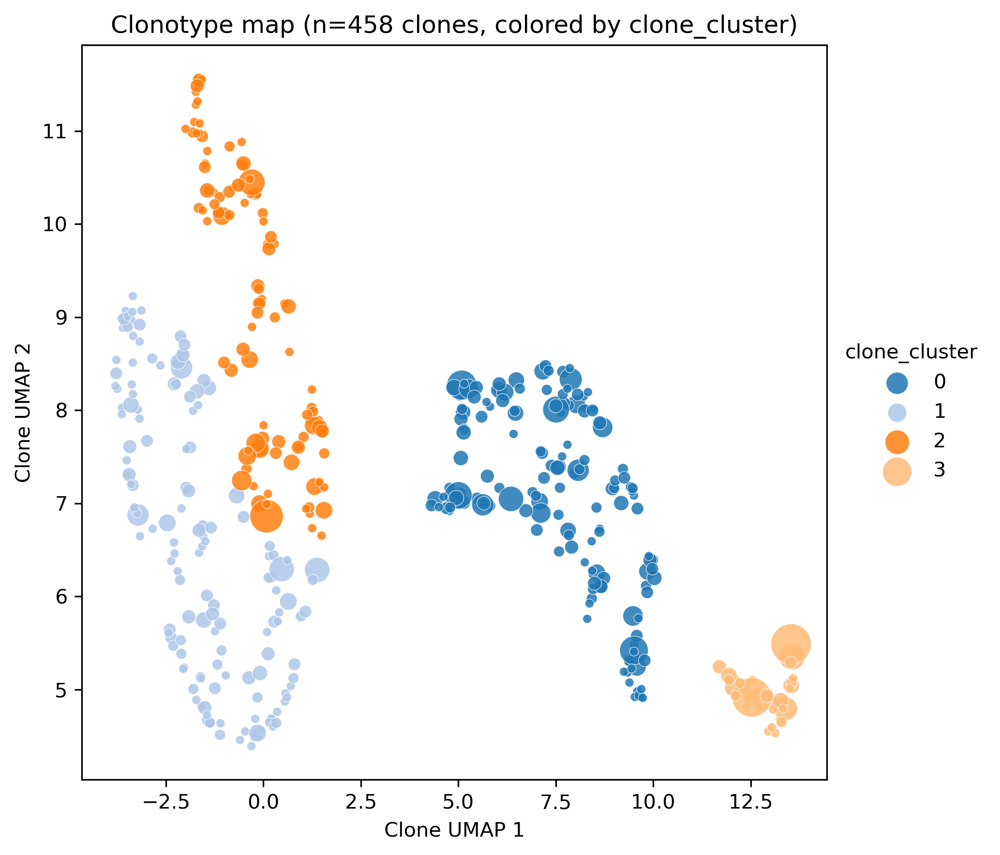
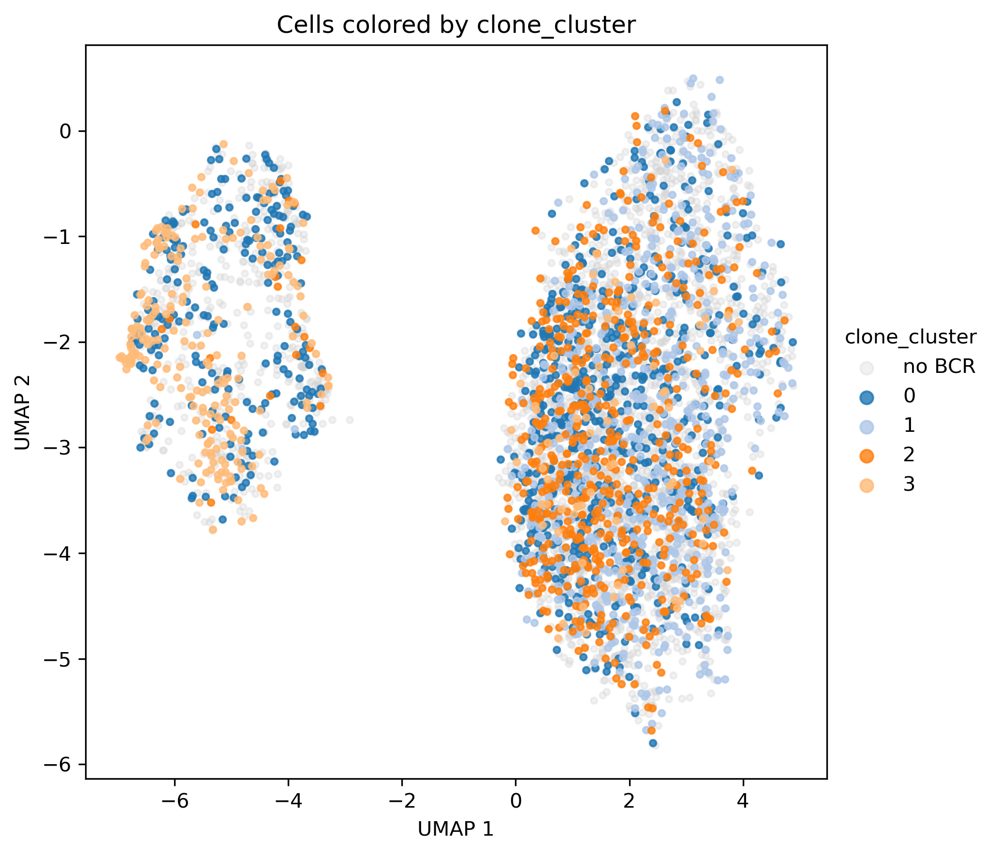
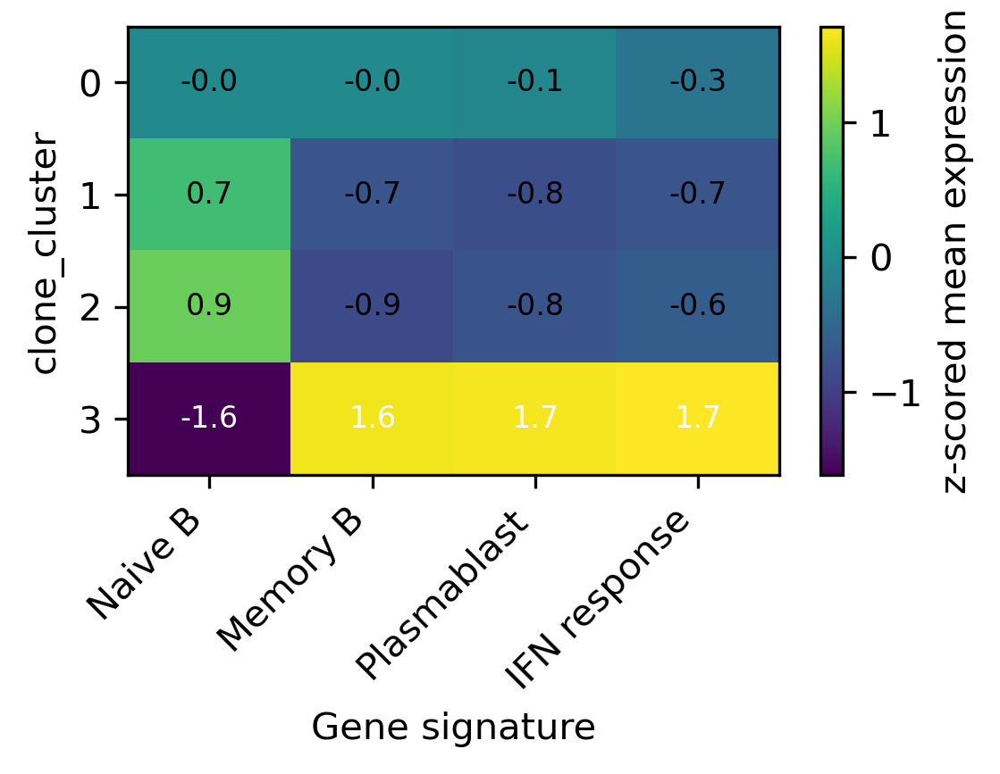
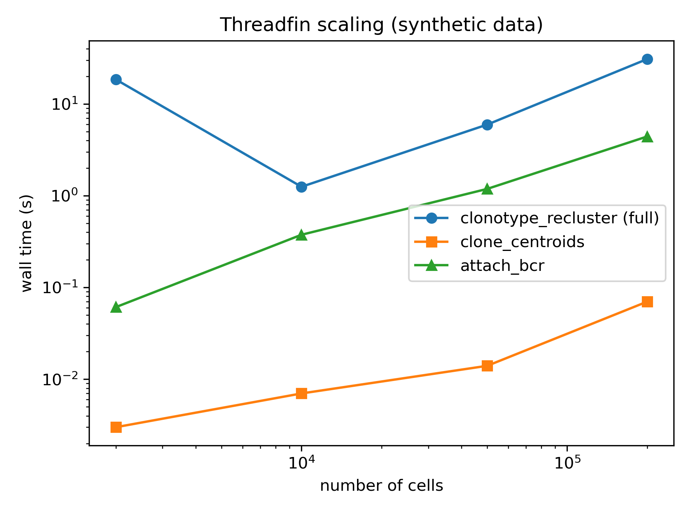

# Threadfin

**Transcriptional-state-aware reclustering of B-cell clonotypes from paired scRNA-seq + scBCR-seq data.**

[](LICENSE)
[](https://www.python.org)

## The idea

scBCR-seq defines **clonotypes** from rearranged V(D)J sequences; scRNA-seq defines
**transcriptional states** from gene expression. Threadfin links the two at the
*clone* level:

1. every clonotype is placed at the **centroid of its member cells** in a
   transcriptional embedding (UMAP/PCA/any `obsm` basis);
2. clonotypes are clustered in that space (kNN graph + Leiden), optionally
   blending in CDR3 amino-acid sequence distance (`cdr3_weight`);
3. the resulting `clone_cluster` label is mapped back to cells, and a
   diffusion pseudotime can be computed **over clones**, tracing how clonal
   lineages move between transcriptional states (e.g. germinal-center
   light-zone → pre-memory / pre-plasma fates).

Instead of asking *"which clones share a sequence?"* (the classic repertoire
question), Threadfin asks *"which clones share a fate?"*.

## Why Threadfin — comparison with existing tools

| Tool | Language | What it does with clonotypes | Clusters clonotypes by transcriptional state | Clone-level pseudotime | Sequence×expression blended distance |
|---|---|---|---|---|---|
| [scirpy](https://github.com/scverse/scirpy) | Python | CDR3-similarity clonotypes, repertoire stats, UMAP overlays | ✗ | ✗ | ✗ |
| [dandelion](https://github.com/zktuong/dandelion) | Python | VDJ contig annotation, clonal networks, cell-level trajectory | ✗ | ✗ (cell-level) | ✗ |
| [scRepertoire](https://github.com/ncborcherding/scRepertoire) | R | clonotype counting/overlap/gene usage on Seurat objects | ✗ | ✗ | ✗ |
| [Immcantation (SCOPer/Change-O)](https://immcantation.readthedocs.io) | R | clonal-family definition & lineage trees from sequences | ✗ | ✗ (lineage trees) | ✗ |
| [Benisse](https://github.com/wooyongc/Benisse) | Python+R | BCR sequence embedding + sparse-graph integration with GEX | ✗ | ✗ | ✓ (ADMM graph learning) |
| **Threadfin** | Python | **clone centroids in GEX space → clone communities** | **✓** | **✓ (DPT on the clone graph)** | **✓ (`cdr3_weight`, and a coupled GEX+BCR graph embedding, `joint_embedding`)** |

Threadfin is complementary, not competing: run your favourite VDJ pipeline
(Cell Ranger / Immcantation / dandelion) upstream, then use Threadfin to
interpret clones in transcriptional space.

## Installation

```bash
pip install "git+https://github.com/Reynold4k/Threadfin.git"
# graph clustering backend:
pip install igraph leidenalg
```

or from a clone: `pip install -e ".[leiden,test]"`.

## Quick start

```python
import threadfin as tf

# 1) per-cell BCR table (10x filtered_contig_annotations.csv or AIRR TSV)
bcr = tf.read_10x_vdj("filtered_contig_annotations.csv")
bcr = tf.build_clone_key(bcr, strategy="vdj")   # v_call_d_call_j_call

# 2) attach to an existing scanpy object (needs adata.obsm['X_umap'])
adata = tf.attach_bcr(adata, bcr)               # adds obs['clone_id']

# 3) cluster clonotypes by transcriptional state and trace clone dynamics
adata = tf.clonotype_recluster(adata, min_clone_size=3, resolution=0.3)
adata = tf.clonal_pseudotime(adata)

# 3b) v2: joint GEX+BCR latent embedding (coupled graph, Benisse-inspired)
tf.joint_embedding(adata, basis="X_pca", lam=0.5)
adata = tf.clonotype_recluster(adata, basis="joint", key_added="joint_cluster")
print(tf.integration_diagnostics(adata))

# 4) evaluate + visualize
print(tf.metrics.state_concordance(adata, "clone_cluster", "leiden"))
print(tf.metrics.state_enrichment(adata, "clone_cluster", "leiden"))
tf.plotting.clone_map(adata, color="clone_cluster", save="clone_map.png")
tf.plotting.cells(adata, color="clone_cluster", save="cells.png")
```

A runnable end-to-end example on public data is in
[`examples/quickstart.py`](examples/quickstart.py).

## What's new in v2

Threadfin 2.0 adds a principled BCR-sequence layer (design contract:
[`docs/DESIGN_V2.md`](docs/DESIGN_V2.md)):

- **BLOSUM62-aware CDR3 similarity** (affine-gap global alignment, with
  equal-length Hamming fast paths) instead of v1's equal-length-only Hamming;
- a **sparse clone×clone BCR similarity graph** whose candidate pairs are
  restricted to same-V/J blocks (the Benisse SI constraint — biologically the
  right support set, and the reason it scales);
- **sequence-similarity clone definition** (`define_clones`), the
  scirpy-style sequence view, available natively;
- a **coupled GEX+BCR clone embedding** (`joint_embedding`): Benisse's
  latent geometry (a regularized inverse of a coupled graph Laplacian, i.e.
  commute-time distances) computed directly with sparse normalized-Laplacian
  eigenmaps — no ADMM, no dense n×n solves, no torch dependency;
- **integration diagnostics** quantifying how much each modality drives the
  joint structure (Benisse `testCor` analogues) — including honest reporting
  when the BCR modality contributes nothing on a dataset;
- clone-level biology readouts: isotype composition, SHM load, and
  clone fate tracking across timepoints (`tf.clones`).

## Benchmarks

### Real data: paired GEX+BCR from COVID-19 PBMC

Dataset: Stephenson et al. 2021 (*Nature Medicine*), prepared by
[scirpy](https://github.com/scverse/scirpy) — 5,000 BCR-containing B-lineage
cells (4,077 B cells + 923 plasmablasts), downloaded by
[`benchmarks/download_data.sh`](benchmarks/download_data.sh).

| Step | Result |
|---|---|
| cells with BCR attached | 5,000 / 5,000 (vectorized join, ~1 s) |
| clonotypes (V-D-J key) | 2,667 (median size 1; 458 expanded clones with ≥3 cells) |
| clone clusters | 4 |
| runtime `clonotype_recluster` | 7.2 s (458 clones; includes clone-map UMAP) |
| clone state-purity | median 1.0; 65 % of expanded clones > 0.8 pure |

The four clone communities are biologically coherent. Clone cluster 3 — a
well-separated island of large, expanded clones — captures plasmablast-fated
clones with overwhelming significance, and shows the expected
plasmablast / interferon-response gene-signature profile:

| clone cluster | enriched state | odds ratio | FDR (BH) |
|---|---|---|---|
| 3 | Plasmablast | 22.7 | 7.9 × 10⁻¹¹¹ |
| 1 | B cell | 81.5 | 6.9 × 10⁻⁶⁹ |
| 2 | B cell | 7.7 | 1.2 × 10⁻³⁰ |

(Fisher exact test, one-sided "greater"; full table in
[`benchmarks/results/state_enrichment.csv`](benchmarks/results/state_enrichment.csv).
Global label-agreement scores such as ARI are modest (0.09) because the
two-state reference is highly imbalanced — the clone communities resolve
finer structure than a B-cell/plasmablast split.)

| clonotype map | cells colored by clone cluster | signature heatmap |
|---|---|---|
|  |  |  |

### Multi-dataset biological validation

Threadfin v2 was validated end-to-end on five public paired scRNA+scBCR
datasets (download scripts + loaders in
[`benchmarks/biological_validation/`](benchmarks/biological_validation/),
dataset manifest in [`benchmarks/datasets_manifest.tsv`](benchmarks/datasets_manifest.tsv)):

| dataset | cells | clones | expanded (>=3) | clone purity vs permutation null | held-out co-clustering vs chance |
|---|---|---|---|---|---|
| Stephenson 2021 COVID PBMC (5k) | 5,000 | 4,823 | 22 | 0.97 vs 0.82 (p=0.005) | n/a (2 communities) |
| Flu vaccine (Wang 2023) | 123,693 | 80,682 | 499 | 0.88 vs 0.36 (p=0.005) | 0.97 vs 0.26 |
| Tonsil (King 2021) | 22,478 | 10,473 | 200 | 0.66 vs 0.49 (p=0.005) | 0.99 vs 0.66 |
| EBV organoid (Mitul 2026) | 205,630 | 89,757 | 4,564 | 0.79 vs 0.31 (p=0.005) | 0.985 vs 0.101 |
| LN vaccine GC (Kim 2022) | 193,442 | 92,761 | 4,396 | 0.85 vs 0.48 (p=0.005) | 0.93 vs 0.09 |

Full interpretation, including the negative results (basis-dependent fine
boundaries; sparse clone-level BCR graphs), is in
[`docs/BIOLOGICAL_INTERPRETATION.md`](docs/BIOLOGICAL_INTERPRETATION.md).
Cross-dataset machine-readable summary:
[`benchmarks/biological_validation/results/cross_dataset_summary.md`](benchmarks/biological_validation/results/cross_dataset_summary.md).

### Scaling (synthetic data, up to 200k cells / 10k clones)

| cells | clones | attach_bcr | centroids | recluster | pseudotime | peak RSS |
|---|---|---|---|---|---|---|
| 2,000 | 200 | 0.06 s | 0.003 s | 18.5 s\* | 1.5 s | 0.46 GB |
| 10,000 | 833 | 0.38 s | 0.007 s | 1.3 s | 0.04 s | 0.47 GB |
| 50,000 | 3,333 | 1.2 s | 0.014 s | 5.9 s | 0.21 s | 0.50 GB |
| 200,000 | 10,000 | 4.4 s | 0.07 s | 30.8 s | 26.4 s | 0.59 GB |

\*first call pays numba JIT compilation. Runtime scales with the number of
*clones* (graph size), not cells, because all per-cell work is vectorized.



Reproduce everything:

```bash
bash benchmarks/download_data.sh data/            # ~52 MB public dataset
python benchmarks/run_real_benchmark.py data/stephenson2021_5k.h5mu benchmarks/results
python benchmarks/run_scaling_benchmark.py benchmarks/results
# or on SLURM: sbatch benchmarks/threadfin_benchmark.sbatch
```

## Why Threadfin is worth publishing

1. **A capability no published tool has.** scirpy, dandelion, scRepertoire and
   Immcantation all operate *sequence-first*: they define/quantify clonotypes
   from V(D)J sequences and then display them on expression embeddings.
   Threadfin inverts the analysis: it discovers **communities of clonotypes
   that occupy the same transcriptional state**, plus a clone-level
   pseudotime that describes how lineages traverse states. To our knowledge
   no published package offers this.
2. **A real biological motivation.** The method was developed for
   germinal-center B-cell data (NP-CGG immunization, IGHV1-72 NP-response
   clones), where the question "which clones are heading to plasma vs memory
   fates?" cannot be answered by sequence similarity alone — affinity-matured
   sister clones diverge in sequence while sharing fate.
3. **Engineering that meets the bar.** Fully vectorized (the original
   research code's per-cell Python loops are gone), deterministic given a
   seed, 12 unit/integration tests, CI via GitHub Actions, standard
   `pyproject.toml` packaging, MIT-licensed, benchmarked end-to-end on public
   data (results committed in `benchmarks/results/`).
4. **Fits the publication formats for software.** Suited to a JOSS paper or a
   Bioinformatics/Briefings application note, and immediately citable as the
   analysis component of the accompanying germinal-center study.

## API overview

| Function | Purpose |
|---|---|
| `tf.read_10x_vdj` / `tf.read_airr` | read Cell Ranger / AIRR-format BCR tables |
| `tf.build_clone_key` | build clonotype keys (`vdj` / `clonotype_id` / `cdr3`) |
| `tf.define_clones` | sequence-similarity clone (re)definition via the BCR graph |
| `tf.bcr_similarity_graph` | sparse clone×clone BCR similarity graph (V/J-blocked, BLOSUM62-aware) |
| `tf.attach_bcr` | attach BCR annotations to `AnnData` (vectorized) |
| `tf.clone_centroids` | per-clone centroids in any embedding (optionally weighted) |
| `tf.clonotype_recluster` | the core: clone clustering in state space (incl. `basis="joint"`) |
| `tf.joint_embedding` | coupled GEX+BCR graph embedding of clones (Benisse-inspired, ADMM-free) |
| `tf.integration_diagnostics` | latent-vs-GEX / latent-vs-BCR correlations, modality contribution |
| `tf.clonal_pseudotime` | diffusion pseudotime over the clone graph |
| `tf.clones.clone_isotype_summary` / `clone_shm_summary` | isotype / SHM per clone or community |
| `tf.clones.clone_fate_table` / `community_transition` | clone fate tracking across timepoints |
| `tf.metrics.state_concordance` | NMI/ARI vs reference cell states |
| `tf.metrics.state_enrichment` | per-cluster state enrichment (Fisher + FDR) |
| `tf.metrics.clone_state_purity` | per-clone state purity/entropy |
| `tf.sequence.cdr3_similarity` / `atchley_embedding` | BLOSUM62-aware CDR3 similarity; deterministic physicochemical embedding |
| `tf.plotting.clone_map` / `cells` / `signature_heatmap` | publication-quality figures |

The legacy entry point `bcr_reclustering(adata, bcr_table)` from the original
research code still works (deprecated alias).

## Citing Threadfin

If you use Threadfin, please cite this repository
(https://github.com/Reynold4k/Threadfin). A manuscript is in preparation.

## License

[MIT](LICENSE) © 2026 Chen Satoshi (Reynold4k)
