# Threadfin

**Clonotype-level inference of B-cell transcriptional states and fates from paired scRNA-seq + scBCR-seq data.**

[](LICENSE)
[](https://www.python.org)
[](https://github.com/Reynold4k/Threadfin/actions/workflows/tests.yml)

Threadfin integrates paired single-cell BCR and transcriptome data to place
every B-cell clonotype into a transcriptional state space. Classic repertoire
tools ask *"which cells share a receptor sequence?"* — Threadfin asks the
orthogonal question:

> **"What are the clones doing — and which genetically distinct clones are
> doing the same thing?"**

Each clonotype is placed at the centroid of its member cells in a
gene-expression embedding; clonotypes are then clustered in that space into
**clone communities** — groups of genetically distinct clones that converge
on the same transcriptional state or fate. Communities are mapped back to
cells for inspection, and clonal state transitions are inferred across real
timepoints or along a diffusion-based ordering of the clone graph. The BCR
sequence layer (BLOSUM62-aware CDR3 similarity, sequence-aware lineage
grouping, coupled GEX+BCR graph embedding inspired by Benisse) is used where
it provably helps — and the v3 discovery layer connects communities to
antigen specificity, affinity maturation, tissue migration and gene
programmes, with null-model validation throughout.

## The gap Threadfin closes

A systematic review of the published tools and their public issue trackers
(full evidence with quotes and links: [`docs/GAP_ANALYSIS.md`](docs/GAP_ANALYSIS.md)):

* **No tool groups clones by transcriptional state.** Benisse's graph is
  hard-constrained by V/J sequence; CoNGA tests sequence↔expression
  correlation but does not group clones; dandelion's V(D)J feature space is
  pseudobulk V/J usage; mvTCR embeds cells, not clones; scirpy/scRepertoire/
  Immcantation are sequence-first toolboxes.
* **No tool validates clone–state coupling statistically.** We ship
  within-donor permutation nulls, size-matched community nulls, held-out
  split-clone replication and cross-basis robustness — run on 5 public
  datasets, with failures reported as-is.
* **Clone fate/migration tracking is chronically unmet** — scirpy's
  STARTRAC-indices issue has been open since 2020
  ([#36](https://github.com/scverse/scirpy/issues/36)); users repeatedly ask
  how to follow clones across clusters, timepoints and tissues
  (scRepertoire [#428](https://github.com/BorchLab/scRepertoire/issues/428),
  [#585](https://github.com/BorchLab/scRepertoire/issues/585)).
* **Real repertoires break sequence-first tools**: the median clonotype has
  exactly 1 cell in every dataset we analysed; cell-level clone networks die
  past ~20k cells ([dandelion #235](https://github.com/tuonglab/dandelion/issues/235))
  and lineage-tree builders can be left with zero clones
  ([dowser #38](https://github.com/immcantation/dowser/issues/38)).
  Threadfin's clone-as-node design scales with clone count, not cell count.
* **Pure Python, scanpy-native, CPU-only** — no GPU (mvTCR), no R+torch
  two-language stack (Benisse/TESSA), no C++ deps (CoNGA).

## Why infer states at the level of clones?

Two properties of real B-cell repertoires motivate Threadfin's design.

**1. Repertoires are dominated by singletons; lineage trees cover a small,
unrepresentative minority.** In every dataset analysed below, the median
clonotype size is exactly one cell, and clonotypes expanded to ≥3 cells make
up only 0.5–5% of the repertoire. This is not specific to our data:
re-analysis of large immune repertoires likewise found that *"the majority
of clonotypes were singletons and only 9–18% of patients' clonotypes were
clonally expanded"* ([Sturm et al. 2020](https://doi.org/10.1093/bioinformatics/btaa611)).
Phylogenetic methods in the Immcantation/SCOPer tradition
([Gupta et al. 2015](https://doi.org/10.1093/bioinformatics/btv359);
[Nouri & Kleinstein 2018](https://www.frontiersin.org/articles/10.3389/fimmu.2018.00682/full))
can only build lineage trees for that small expanded fraction — and even
where a tree can be inferred, it encodes the **ancestry of the receptor
sequence** (which somatic mutation descended from which), not what the cells
are doing. A clone tree cannot, by construction, tell you whether a clone is
becoming a plasmablast or a memory cell.

**2. Receptor identity ≠ cell state, in both directions.** Cells of the same
clonal group routinely occupy different transcriptional clusters — *"even
when cells belonged to the same BCR or TCR clonal group, they could still be
found in different transcriptional clusters … lymphocytes sharing the same
immune receptor specificity may still undergo very different cell fates and
functions in the course of an immune response"* ([Yermanos et al. 2021](https://pmc.ncbi.nlm.nih.gov/articles/PMC8046018/)).
Conversely, genetically unrelated clones converge on the same state during a
response: affinity-matured sister clones diverge in sequence while sharing
fate. A sequence network is blind to both directions because it never looks
at the transcriptome; a cell-level clustering cannot see that this
convergence happens **clone by clone**, not cell by cell.

Threadfin therefore treats the **clone as the unit of inference in
transcriptional state space** — the same conceptual question Benisse posed
(*"refined analyses of BCRs guided by single-cell gene expression"*,
[Zhang et al. 2022](https://www.nature.com/articles/s42256-022-00492-6)),
operationalized inside the scanpy ecosystem with explicit permutation nulls,
held-out replication, and basis-robustness checks for every claim.

---

## Walkthrough: five public datasets, end to end

Everything below is reproduced by two committed pipelines —
[`benchmarks/biological_validation/`](benchmarks/biological_validation/)
(clone-community inference + null models + held-out replication) and
[`benchmarks/discovery/`](benchmarks/discovery/) (specificity, SHM,
migration, gene programmes). Dataset sources and checksums:
[`benchmarks/datasets_manifest.tsv`](benchmarks/datasets_manifest.tsv).

**How to read the figures.** A *clone map* has one point per clonotype (a
genetically distinct B-cell lineage); point size = how expanded the clone
is; position = the average transcriptional state of that clone's cells;
colour = the inferred **clone community** (clones whose cells are doing the
same thing). Communities are then scored against biology the algorithm never
saw: author cell-type labels, experimentally measured antigen specificity,
viral-infection status, clinical severity.

**How to read the numbers.** *OR* (odds ratio) = how many times more likely
than chance (OR 5 = 5× enriched). *FDR* = p-value corrected for multiple
testing. *vs null* = compared against the same analysis with clone labels
shuffled within each donor. *Held-out* = split every big clone's cells into
two independent halves, re-run the whole pipeline, and check the two halves
land in the same community — this rules out that communities are an artefact
of the cells we happened to sample.

### 1. Lymph-node germinal-centre response to mRNA vaccination
*[Kim et al. 2022, Nature](https://www.nature.com/articles/s41586-022-04527-1) — GSE195673 / [Zenodo 5895181](https://zenodo.org/records/5895181) (8 donors, 193,442 B cells, LN FNA + blood + bone marrow, d28–d201)*

**The study.** Eight mRNA-vaccine recipients were sampled for months after
vaccination: fine-needle aspirates of the draining lymph node, plus blood
and bone marrow. The paper's headline: vaccine-induced germinal centres
(GCs) persist for months and keep maturing spike-specific B cells long after
the blood response fades. The authors annotated every cell (GC / memory /
naive / plasmablast / LN plasma cell), experimentally tested which clones
bind spike, and measured each receptor's mutation load. That makes this the
perfect test bed: we can build communities on expression alone and then
check them against three independent experimental readouts.

**What Threadfin did.** Of the 92,761 distinct clones, 4,396 are expanded
(≥3 cells) — the rest are singletons and carry no analysable signal.
Threadfin placed each expanded clone at its cells' average position in
expression space and grouped them into **11 clone communities**, using no
sequence, no author labels, no specificity information.

**Walking through the main figure** (left to right):

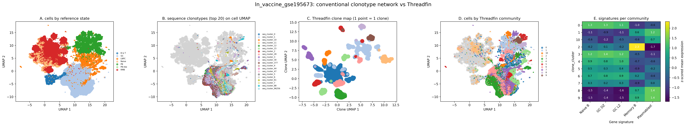

* **Panel A — the cells as the authors see them.** Every dot is a cell,
  coloured by the authors' annotation. This is the reference landscape the
  communities must recover without ever being shown.
* **Panel B — why the classic view is not enough.** The 20 largest
  sequence-defined clones overlaid on the cell UMAP: each clone is a
  scattered cloud spread over several states. You can see *which cells are
  related*, but nothing about *what they are doing* — and certainly not
  which *different* clones behave alike. This is the gap.
* **Panel C — the Threadfin clone map.** Now each clone is a single point
  (size = expansion). Clones that behave alike sit together and form
  visible neighbourhoods; the clustering of these points gives the 11
  communities. Because clones are points rather than clouds, "which clones
  behave alike" becomes a question you can answer by looking.
* **Panel D — communities projected back onto cells.** Each cell takes its
  clone's community colour. If communities were random, this panel would be
  salt-and-pepper noise; instead, communities occupy coherent regions of the
  cell landscape — they line up with the real cell states of panel A
  (17–37 significant community↔state enrichments per parameter setting;
  size-matched random groupings essentially never do this, p = 0.015).
* **Panel E — gene programmes per community.** The plasmablast programme
  (the antibody-secreting machinery: XBP1, JCHAIN, MZB1) lights up exactly
  one community. Because no gene signatures were used to build the
  communities, this clean separation is independent evidence that the
  communities are biologically coherent.

**Three independent layers agree with the communities:**

1. *Cell states.* The largest community maps onto GC cells (17,464 cells,
   OR 2.4, FDR ≈ 0); at higher resolution a dedicated plasmablast community
   emerges (OR 156).
2. *Antibody class.* Class-switching was never shown to the algorithm, yet
   the three largest communities are 80%, 88% and 83% IgG, while others are
   IgM/IgD-rich. Two molecular layers that were measured independently vote
   for the same grouping.
3. *Time.* We followed 1,016 clones across consecutive timepoints
   (d28 → d60 → d110). Every single one (1,016/1,016) stayed in its
   community — a clone's position in the response at day 28 predicts its
   position months later, echoing the paper's finding that vaccine GC
   clones are durable lineages rather than transient bursts.

**Then we confronted the communities with experiments the method never saw:**

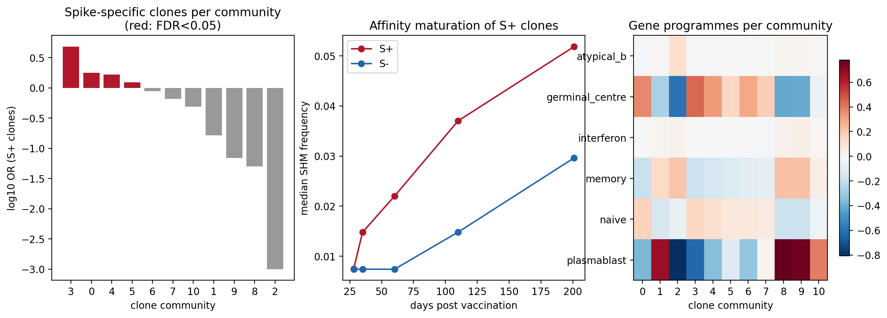

* **Left panel — antigen specificity.** The authors had lab-tested which
  clones bind spike (1,368 spike-positive clones; 1,350 of them confirmed
  by ELISA). One community is 86.6% spike-binding clones (OR 4.8, FDR ≈ 0,
  9,013 cells), and communities 0/4/5 follow (70%/73%/67% spike-binding;
  OR 1.7–1.8, FDR ≤ 1e-51). Because the communities were built from
  expression alone, this alignment means *transcriptional state and antigen
  specificity are coupled at the level of whole clones* — clones that bind
  the vaccine antigen behave alike. Note the mirror image: communities 8
  and 9, which carry the strongest plasmablast programme (right panel), are
  *depleted* of spike binders (8% and 11%) — consistent with circulating
  plasmablasts being a mixed bag of many specificities, while the lymph-node
  GC communities are the vaccine-driven ones.
* **Middle panel — affinity maturation, reconstructed.** Spike-binding
  clones accumulate mutations month after month: median SHM 0.75% (d28) →
  1.5% (d35) → 2.2% (d60) → 3.7% (d110) → 5.2% (d201) of V-region
  nucleotides, ahead of non-binding clones from d35 onwards (Mann–Whitney
  p ≤ 1e-81). Because SHM accumulates inside GCs under selection, this
  widening red–blue gap *is* the affinity-maturation engine running on
  vaccine-specific clones — the paper's central result, recovered from clone
  communities alone.
* **Right panel — gene programmes.** The GC programme (AICDA/BCL6/RGS13)
  marks communities 0, 3, 4; the plasmablast programme marks 1, 8, 9, 10;
  the naive programme is lowest exactly in the GC communities. Each
  community owns a distinct functional programme.
* **Emigration (not shown).** Spike-binding expanded clones are 2.8× more
  likely than other clones to appear in *both* lymph node and blood (25.1%
  vs 9.1%) — the clonal footprint of GC cells leaving for circulation.

Statistics: cells of one clone are far more state-coherent than chance
(purity 0.849 vs 0.478 within-donor null, p = 0.005); held-out clone halves
re-co-cluster at **0.93 vs 0.09 chance** (1,517 clones).
Reproduce: [`configs/ln_vaccine_gse195673.json`](benchmarks/biological_validation/configs/ln_vaccine_gse195673.json) →
[`results/ln_vaccine_gse195673/`](benchmarks/biological_validation/results/ln_vaccine_gse195673/) +
[`discovery results`](benchmarks/discovery/results/ln_vaccine_gse195673/).

### 2. Influenza vaccination, young vs older adults
*[Wang et al. 2023](https://pmc.ncbi.nlm.nih.gov/articles/PMC10564424/) — GSE175522/GSE175523 (6 donors × d0/d7, 123,693 cells)*

**The study.** Six donors (three young, three older) sampled before (d0) and
seven days after (d7) seasonal flu vaccination — the classic setting for
studying why vaccine responses weaken with age. Crucially, the authors
tracked clone IDs across timepoints, so **711 clones are seen at both d0 and
d7**: we can follow what the *same clone* did, rather than compare two
independent snapshots.

**What Threadfin did.** 80,682 clonotypes, 499 expanded (≥3 cells) → 3
communities at the reference resolution (more at higher resolution). Blood
B cells are a mixture of resting and responding cells, so the question is
whether the day-7 plasmablast burst is visible as a *clonal* phenomenon.

**What we found.**

* *The day-7 antibody burst is carried by a few clone communities.*
  Expanded d7 plasmablast clones pile into a small number of communities
  (OR 290; OR 1,341 at higher resolution; both FDR ≈ 0). If the response
  were a diffuse mobilization of the whole repertoire, plasmablast clones
  would be spread thin; instead they concentrate — the response is
  oligoclonal, and you can point at exactly which communities carry it.
* *Communities remember class-switching.* One community is 75% IgM / 21%
  IgD (unswitched clones); another is 52% IgG / 25% IgA (switched,
  vaccine-experienced clones). Again: isotype was never used.
* *A clone's pre-vaccine state predicts its day-7 state.* Of the clones
  seen at both timepoints, every community assignment carried over (272/272
  transitions diagonal). Clone–state coupling is the strongest of all five
  datasets (purity 0.883 vs 0.356 null, p = 0.005; held-out 0.97 vs 0.26
  chance) — in an acute recall response, what a clone does is maximally
  determined by which clone it is.

| clone map (499 clones) | communities on the cell UMAP |
|---|---|
| 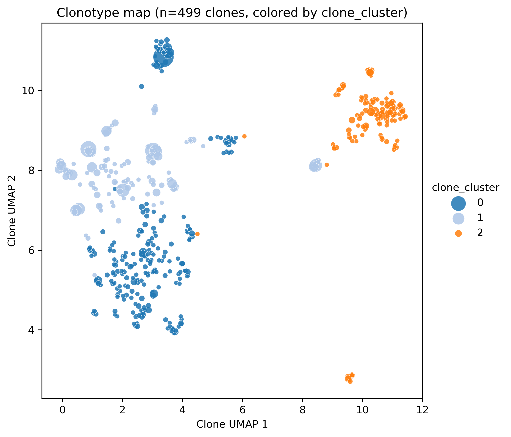 | 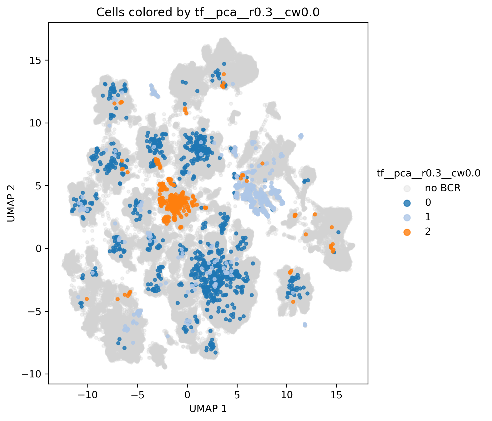 |

*Left — the clone map: one point per clone. The orange community sits apart
from the rest; it is the switched (IgG/IgA), vaccine-responsive compartment.
Right — communities projected back onto all 123,693 cells (grey = no BCR
recovered): each community occupies its own region of the cell landscape,
so the clone-level grouping reflects real cell-state structure rather than
clonal noise.*

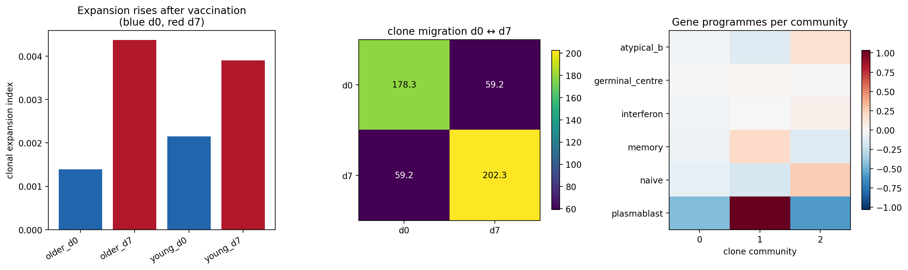

* **Left — expansion dynamics.** The clonal expansion index rises from d0
  (blue) to d7 (red) in both young and older donors: vaccination measurably
  restructures the repertoire within a week, at every age. (The index
  measures how uneven clone sizes are — a few big clones dominate after
  vaccination.)
* **Middle — clones shared between timepoints.** The off-diagonal (59.2)
  quantifies clones observed at *both* d0 and d7 — the substrate of the
  perfectly stable community assignments above.
* **Right — gene programmes.** The plasmablast programme lights up community
  1 — the same community where the expanded d7 plasmablast clones
  concentrate. Two independent views (state enrichment and gene programme)
  name the same community as the engine of the response.
* *The repertoire is private*: exactly 1 clone was shared between any two
  of the 6 donors — vaccine-responsive clones are person-specific, which is
  why repertoire studies need per-donor null models (ours shuffle labels
  within donor).

Reproduce: [`configs/flu_gse175522.json`](benchmarks/biological_validation/configs/flu_gse175522.json) →
[`results/flu_gse175522/`](benchmarks/biological_validation/results/flu_gse175522/) +
[`discovery results`](benchmarks/discovery/results/flu_gse175522/).

### 3. Human tonsil B-cell maturation
*King et al. 2021 — [E-MTAB-9005](https://www.ebi.ac.uk/biostudies/arrayexpress/studies/E-MTAB-9005)/E-MTAB-9003 (6 donors, 22,478 B-lineage cells)*

**The study.** A tonsil atlas covering the whole B-cell maturation axis —
naive → germinal centre (dark/light zone) → memory (including the FCRL4⁺
subset) → plasmablast — in 15 author-annotated states.

**Why this dataset is a stress test.** In an active GC, every B-cell lineage
keeps mutating, so its cells all carry slightly different receptors: exact
clonotypes here are almost all singletons (13 of 10,473 have ≥3 cells). Any
clone-level analysis built on exact clonotypes is dead on arrival in exactly
the tissue where B-cell biology is richest. This is the same failure users
hit in public issue trackers (dowser ends up with zero clones to build trees
on; cell-level clone networks collapse under singletons).

**What Threadfin did differently.** Its sequence-aware step
(`define_clones`) merges hypermutation variants of the same V/J
rearrangement back into lineages — recovering **200 expanded lineages**
where exact clonotypes gave 13. This is why the BCR sequence layer lives
*inside* Threadfin rather than upstream.

**What we found.**

* *A plasmablast lineage community appears under both embedding bases* (OR
  5.8–26.9, FDR ≤ 1e-13) — so the finding does not depend on the
  visualisation method.
* *The signal is clone-level, not noise*: cells of one lineage are more
  state-coherent than chance (purity 0.662 vs 0.489 null, p = 0.005), and
  held-out lineage halves re-co-cluster at 0.99 vs 0.66 chance.
* *Honest limits*: with only 200 lineages, the graph resolves coarse
  structure — community boundaries shift between embeddings (ARI ≈ 0) and
  the enrichment-count null is not rejected. We report this because a
  200-node graph cannot support fine-grained claims; the robust claim is
  the plasmablast community, not the boundaries.

| lineage clone map (200 lineages, resolution 0.8) | plasmablast programme per community |
|---|---|
| 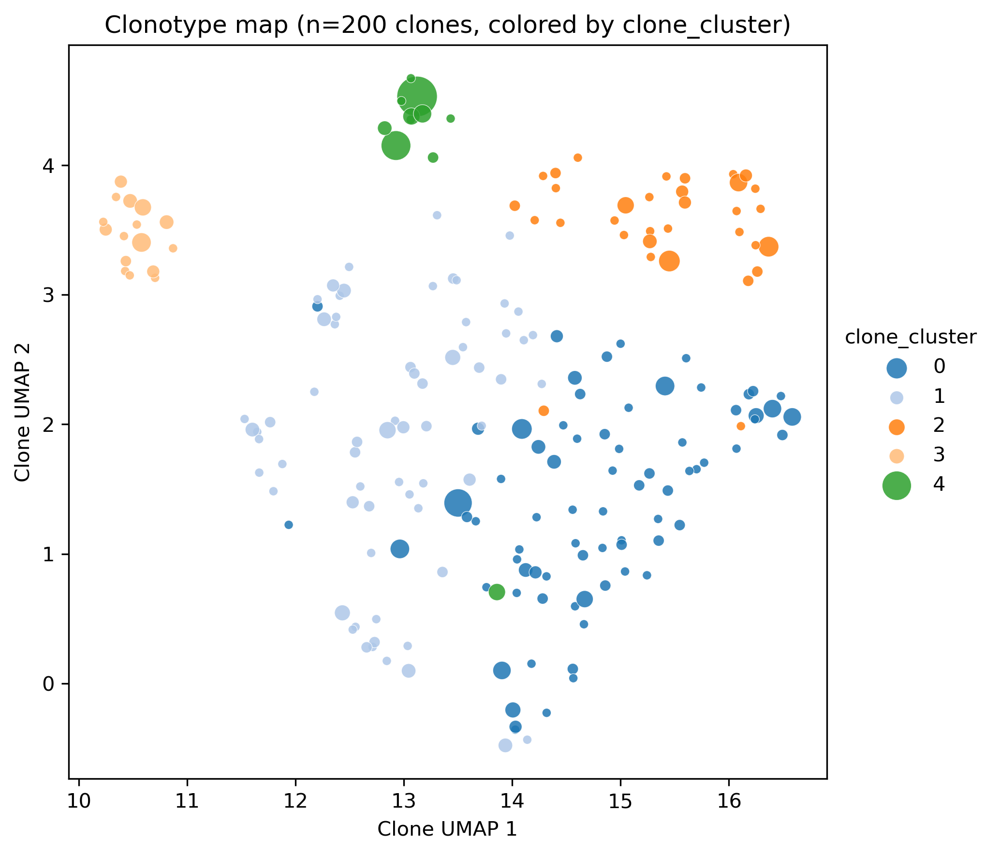 | 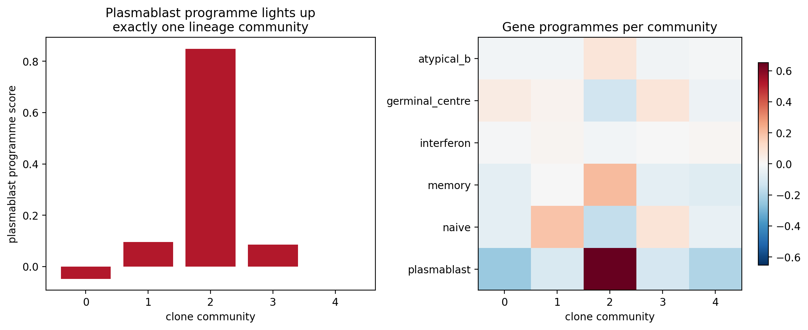 |

*Left — the rescued lineage landscape: each point is an SHM-merged lineage
(not an exact clonotype), coloured by its community at higher resolution.
Right — the antibody-secreting (plasmablast) gene programme lights up
exactly one lineage community (score 0.85 vs ≤ 0.10 everywhere else):
even in a dataset where the standard toolchain cannot define analysable
clones at all, Threadfin recovers the maturation axis' terminal community.*

Reproduce: [`configs/tonsil_king2021.json`](benchmarks/biological_validation/configs/tonsil_king2021.json) →
[`results/tonsil_king2021/`](benchmarks/biological_validation/results/tonsil_king2021/) +
[`discovery results`](benchmarks/discovery/results/tonsil_king2021/).

### 4. Primary EBV infection in tonsil organoids
*[Mitul et al. 2026, PNAS](https://www.pnas.org/doi/10.1073/pnas.2603586123) — GSE317492 (d0–d21, GFP± sorted, 205,630 cells)*

**The study.** Tonsil organoids infected with EBV and followed for 21 days.
At d14/d21 the authors sorted cells by a viral GFP reporter — an
**experimental** label of "this cell is infected", measured by fluorescence,
not by transcriptome. That is the strongest kind of validation label:
it cannot leak into the clustering because it lives on a different physical
channel. Largest dataset here: 4,564 expanded clones out of 89,757.

**What we found.**

* *Communities recover experimental infection.* The dominant clone community
  is **39.7× enriched for GFP+ cells** (10,812 cells, FDR ≈ 0). Communities
  built only from expression + clonality reproduce a label measured by
  viral reporter sorting — because infected clones genuinely share a
  transcriptional state, the community structure sees the infection without
  being told about it.
* *Highest clone–state concordance of all datasets* (NMI 0.67; held-out
  0.985 vs 0.101 chance; purity 0.791 vs 0.314 null).
* *The one dataset where sequence adds clone-level signal.* In the joint
  GEX+BCR embedding, sequence-similar clones sit closer than expected
  (testcor_bcr = 0.31 over 1,389 inter-clone sequence edges). The biology:
  acute infection rapidly expands recently activated, low-mutation clonal
  families, so sequence relatedness and cell state transiently align — the
  regime where Benisse-style sequence-guided integration earns its keep.
  (On the four other datasets the clone-level BCR graph is too sparse to
  matter, and we say so.)
* *The GFP− side is equally structured*: the community carrying the GC
  programme (community 12, right panel below) contains *zero* GFP+ cells —
  the uninfected bystander compartment keeps its own clonal identity.
* *Honest caveat*: the enrichment-count null is not rejected here (32
  observed vs 41.2 expected under size-matched random communities), so the
  claims rest on concordance, purity and held-out replication rather than
  enrichment counts. We also observe essentially no cross-timepoint clone
  sharing (samples pool four donors each), so this dataset is not used for
  fate tracking.

| clone map (4,564 clones) | communities recover experimental infection |
|---|---|
| 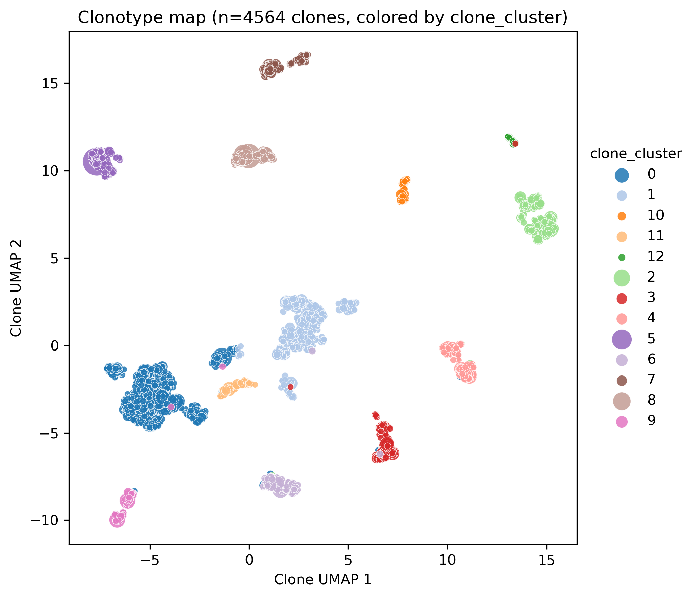 | 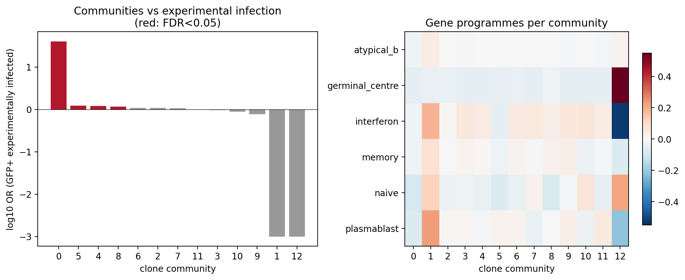 |

*Left — the clonal landscape of the infection time course (13 communities;
each point a clone). Right — per-community enrichment for GFP+ infected
cells (red = significant): community 0 towers over the rest (OR ≈ 40), and
the GC-programme community (12) is completely GFP−. The clone map partitions
the organoid into "infected" and "bystander" biology without ever seeing
the reporter.*

Reproduce: [`configs/ebv_organoid_gse317492.json`](benchmarks/biological_validation/configs/ebv_organoid_gse317492.json) →
[`results/ebv_organoid_gse317492/`](benchmarks/biological_validation/results/ebv_organoid_gse317492/) +
[`discovery results`](benchmarks/discovery/results/ebv_organoid_gse317492/).

### 5. COVID-19 PBMC (the bundled quickstart dataset)
*[Stephenson et al. 2021, Nat Med](https://www.nature.com/articles/s41591-021-01329-2) — 5,000 BCR+ B-lineage cells*

**The study.** The atlas that established a hallmark of severe COVID-19:
an expanded, interferon-activated plasmablast compartment in blood (923 of
the 5,000 B-lineage cells in this subset). This is the dataset bundled with
the quickstart example, so it is deliberately small.

**What we found.**

* *The response is recovered sequence-free.* One clone community is ~198×
  enriched for plasmablasts (193 cells, FDR 6e-34) and expresses the
  plasmablast/interferon programme. Against the authors' finer annotation,
  the same community captures the antibody-secreting states (Plasmablast,
  Plasma_cell_IgG OR 4.9, Plasma_cell_IgA OR 4.2), while the other
  community captures naive (OR 19) and exhausted B cells (OR 28).
* *The community tracks disease severity.* The plasmablast community is
  enriched for cells from severely ill donors (OR 3.5, FDR 0.003), and
  depleted of asymptomatic donors (OR 0.03); the B-cell community shows the
  mirror image (asymptomatic OR 32, FDR 7e-7). Because severity labels were
  never used, the communities stratify the clinic on their own.
* *Reference-database check.* Matching clone CDR3s against CoV-AbDab (all
  published anti-coronavirus antibodies) flags 6 SARS-CoV-2-binding clones
  (including near-identical matches to known neutralizing antibodies). Five
  are singletons, so they carry no community label by design; the one match
  large enough to be assigned sits exactly in the plasmablast community —
  as it should, if that community is the acute anti-viral response. Small
  numbers on a 5k subset; reported as-is.
* *Honest limits*: the subset is sparse (median clone size 1; only 22
  clones with ≥3 cells, so `min_clone_size=2`), and with just two
  communities the held-out test is uninformative. Treat this dataset as the
  tutorial, not as evidence of large-scale structure.

| clone map (75 clones) | permutation null vs observed | community × severity |
|---|---|---|
| 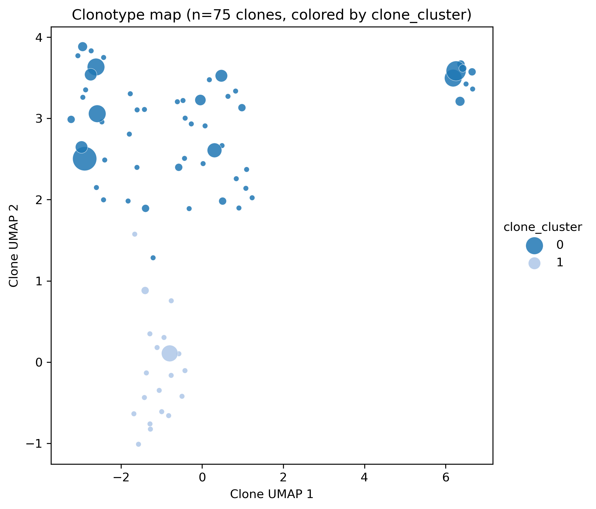 | 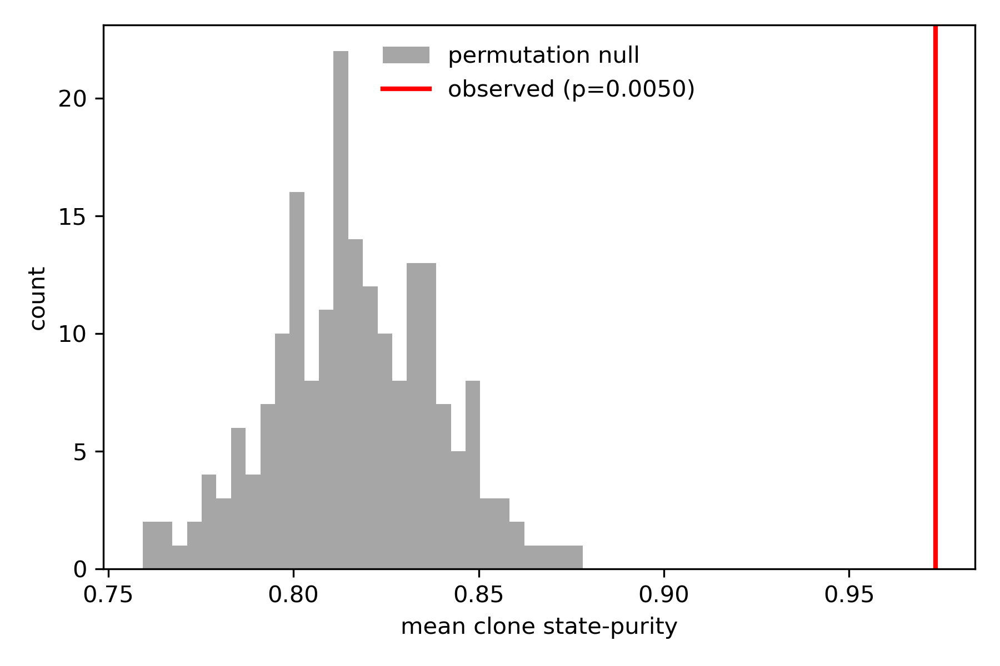 | 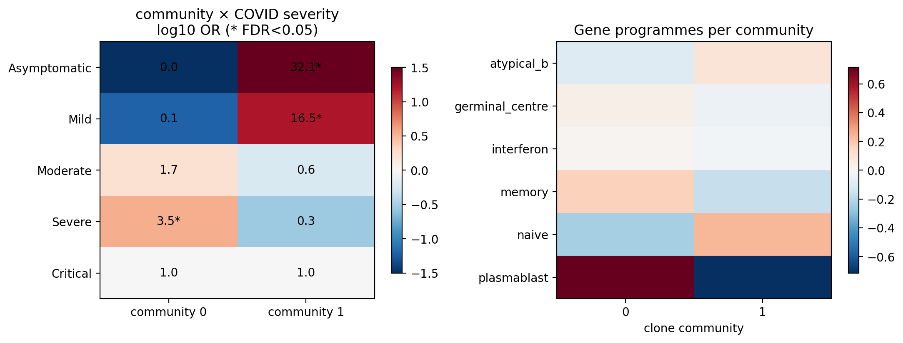 |

*Left — the clone map: the plasmablast community (dark blue) separates
cleanly from the B-cell clones. Middle — why this is not a fluke: the red
line is the observed clone state-purity; the grey histogram is what you get
when clone labels are shuffled within each donor 200 times. They do not
overlap. Right — community × clinical severity odds ratios (\* = FDR <
0.05) and gene programmes per community: the plasmablast community (0) is
the severe-disease compartment.*

Reproduce: [`configs/stephenson2021.json`](benchmarks/biological_validation/configs/stephenson2021.json) →
[`results/stephenson2021/`](benchmarks/biological_validation/results/stephenson2021/) +
[`discovery results`](benchmarks/discovery/results/stephenson2021/).

### Cross-dataset summary

| dataset | cells | clones | expanded (≥3) | clone purity vs permutation null (p) | held-out vs chance |
|---|---|---|---|---|---|
| Stephenson 2021 COVID PBMC (5k) | 5,000 | 4,823 | 22 | 0.97 vs 0.82 (0.005) | n/a (2 communities) |
| Flu vaccine (Wang 2023) | 123,693 | 80,682 | 499 | 0.88 vs 0.36 (0.005) | 0.97 vs 0.26 |
| Tonsil (King 2021) | 22,478 | 10,473 | 200 | 0.66 vs 0.49 (0.005) | 0.99 vs 0.66 |
| EBV organoid (Mitul 2026) | 205,630 | 89,757 | 4,564 | 0.79 vs 0.31 (0.005) | 0.985 vs 0.101 |
| LN vaccine GC (Kim 2022) | 193,442 | 92,761 | 4,396 | 0.85 vs 0.48 (0.005) | 0.93 vs 0.09 |

Machine-readable:
[`results/cross_dataset_summary.md`](benchmarks/biological_validation/results/cross_dataset_summary.md).

## The biological interpretation — and its limits

The full interpretation guide is
[`docs/BIOLOGICAL_INTERPRETATION.md`](docs/BIOLOGICAL_INTERPRETATION.md).
We report what does **not** hold, because it disciplines the claims:

* **Fine-grained community boundaries are basis-dependent** (clone-level ARI
  0.23–0.35 between PCA and UMAP bases on the large datasets). Conclusions
  should be stated at the level of *enrichments*, which do replicate across
  bases — not at the level of exact boundary assignments.
* **The clone-level BCR graph is sparse by biology, not by bug**: distinct
  clonotypes sharing ≥0.85 CDR3 identity within the same V/J are rare
  (0–1,389 edges per dataset), so the joint embedding is GEX-dominated
  (BCR modality ≤ 19%) and on tonsil contributes literally zero edges. The
  BCR modality's real value is upstream (sequence-aware clone definition)
  and in annotation (isotype/SHM per community), not in reweighting
  clone-level geometry. The v1 `cdr3_weight` blend illustrates the failure
  mode of naive distance mixing (on LN it collapses NMI 0.196 → 0.016); it
  is kept for backward compatibility, and the graph-based joint embedding is
  the recommended path.
* **Small clones are noisy.** Conclusions rest on expanded clones
  (`min_clone_size`); the Stephenson 5k subset is included as a reference,
  not as evidence of large-scale structure.
* **Reference-database specificity hits are evidence, not proof**:
  heavy-chain-only matching can collide across antigens for public CDR3s;
  treat `annotate_specificity` reference-mode hits as hypotheses to
  validate, and prefer author-validated labels where they exist.

## Installation

```bash
pip install "git+https://github.com/Reynold4k/Threadfin.git"
pip install igraph leidenalg umap-learn   # graph clustering + embedding
pip install parasail                       # optional: C-accelerated CDR3 alignment
```

or from a clone: `pip install -e ".[leiden,seq,test]"`.

## Quick start

```python
import threadfin as tf

# 1) per-cell BCR table (10x filtered_contig_annotations.csv or AIRR TSV)
bcr = tf.read_10x_vdj("filtered_contig_annotations.csv")
bcr = tf.build_clone_key(bcr, strategy="cdr3")

# 2) attach to an existing scanpy object (needs adata.obsm['X_umap'])
adata = tf.attach_bcr(adata, bcr)               # adds obs['clone_id']

# 3) infer clone communities in transcriptional state space
adata = tf.clonotype_recluster(adata, min_clone_size=3, resolution=0.3)
adata = tf.clonal_pseudotime(adata)             # diffusion ordering of the clone graph

# 3b) joint GEX+BCR latent embedding (coupled graph, Benisse-inspired)
tf.joint_embedding(adata, basis="X_pca", lam=0.5)
adata = tf.clonotype_recluster(adata, basis="joint", key_added="joint_cluster")
print(tf.integration_diagnostics(adata))

# 4) discovery layer: specificity, migration, programmes
adata = tf.annotate_specificity(adata, labels=clone_labels,
                                label_col="spike_specific")
print(tf.specificity_enrichment(adata))          # Fisher per community
print(tf.migration_index(adata, group_key="tissue"))   # STARTRAC-style
print(tf.community_markers(adata))               # marker genes per community

# 5) evaluate + visualize
print(tf.metrics.state_concordance(adata, "clone_cluster", "leiden"))
print(tf.metrics.state_enrichment(adata, "clone_cluster", "leiden"))
tf.plotting.clone_map(adata, color="clone_cluster", save="clone_map.png")
```

A runnable end-to-end example on public data is in
[`examples/quickstart.py`](examples/quickstart.py) (~1 minute).

## Scaling (synthetic data, up to 200k cells / 10k clones)

| cells | clones | attach_bcr | centroids | recluster | pseudotime | peak RSS |
|---|---|---|---|---|---|---|
| 2,000 | 200 | 0.06 s | 0.003 s | 18.5 s\* | 1.5 s | 0.46 GB |
| 10,000 | 833 | 0.38 s | 0.007 s | 1.3 s | 0.04 s | 0.47 GB |
| 50,000 | 3,333 | 1.2 s | 0.014 s | 5.9 s | 0.21 s | 0.50 GB |
| 200,000 | 10,000 | 4.4 s | 0.07 s | 30.8 s | 26.4 s | 0.59 GB |

\*first call pays numba JIT compilation. Runtime scales with the number of
*clones* (graph size), not cells. Reproduce with
`python benchmarks/run_scaling_benchmark.py benchmarks/results`.

## API overview

| Function | Purpose |
|---|---|
| `tf.read_10x_vdj` / `tf.read_airr` | read Cell Ranger / AIRR-format BCR tables (nt-junction translation when `junction_aa` is empty) |
| `tf.build_clone_key` | build clonotype keys (`vdj` / `clonotype_id` / `cdr3`) |
| `tf.define_clones` | sequence-similarity lineage grouping via the BCR graph |
| `tf.bcr_similarity_graph` | sparse clone×clone BCR similarity graph (V/J-blocked, BLOSUM62-aware) |
| `tf.attach_bcr` | attach BCR annotations to `AnnData` (vectorized) |
| `tf.clone_centroids` | per-clone centroids in any embedding (optionally weighted) |
| `tf.clonotype_recluster` | the core: infer clone communities in transcriptional state space (incl. `basis="joint"`) |
| `tf.joint_embedding` | coupled GEX+BCR graph embedding of clones (Benisse-inspired, ADMM-free) |
| `tf.integration_diagnostics` | latent-vs-GEX / latent-vs-BCR correlations, modality contribution |
| `tf.clonal_pseudotime` | diffusion-pseudotime ordering of the clone graph (clonal state-transition inference) |
| `tf.annotate_specificity` / `tf.specificity_enrichment` | clone-level antigen specificity (labels or CoV-AbDab-style reference matching) + per-community enrichment |
| `tf.migration_index` / `transition_index` / `expansion_index` / `clone_distribution` | STARTRAC-style clonal migration/transition/expansion indices |
| `tf.community_markers` / `tf.community_score` | marker genes and gene-programme scores per community |
| `tf.clones.clone_isotype_summary` / `clone_shm_summary` / `shm_gradient_test` | isotype / SHM per clone or community, maturation-gradient tests |
| `tf.clones.clone_fate_table` / `community_transition` / `public_clone_summary` | clone fate tracking; cross-donor public clones |
| `tf.metrics.*` | NMI/ARI concordance, state enrichment (Fisher + FDR), clone purity/entropy |
| `tf.sequence.cdr3_similarity` / `atchley_embedding` | BLOSUM62-aware CDR3 similarity; deterministic physicochemical embedding |
| `tf.plotting.clone_map` / `cells` / `signature_heatmap` | publication-quality figures |

## Comparison with existing tools

Threadfin is **complementary, not competing**: run your favourite V(D)J
pipeline upstream, then use Threadfin to interpret clones in transcriptional
space. The closest published methods either define/analyse clonotypes
sequence-first, or integrate sequence with expression but do not infer
transcriptional-state communities of clones:

| Tool (original publication) | What it does with clonotypes | Infers clone communities by transcriptional state | Clonal trajectory inference | Clone migration indices | Sequence×expression integration |
|---|---|---|---|---|---|
| [scirpy](https://scirpy.scverse.org/) ([Sturm et al. 2020, *Bioinformatics*](https://doi.org/10.1093/bioinformatics/btaa611)) | CDR3-similarity clonotypes, repertoire stats, UMAP overlays | ✗ | ✗ | ✗ ([open issue since 2020](https://github.com/scverse/scirpy/issues/36)) | ✗ |
| [dandelion](https://github.com/zktuong/dandelion) ([Suo et al. 2024, *Nat Biotechnol*](https://pmc.ncbi.nlm.nih.gov/articles/PMC10791579/)) | VDJ reannotation, clonal networks, V(D)J feature-space trajectory | ✗ | ✗ (cell-level only) | ✗ | ✗ |
| [scRepertoire](https://github.com/ncborcherding/scRepertoire) ([Borcherding et al. 2021, *F1000Research*](https://f1000research.com/articles/10-230/v1)) | clonotype counting/overlap/gene usage on Seurat objects | ✗ | ✗ | ✓ (STARTRAC wrapper) | ✗ |
| [Immcantation / SCOPer](https://immcantation.readthedocs.io) ([Gupta et al. 2015, *Bioinformatics*](https://doi.org/10.1093/bioinformatics/btv359); [Nouri & Kleinstein 2018, *Front Immunol*](https://www.frontiersin.org/articles/10.3389/fimmu.2018.00682/full)) | clonal-family definition & lineage trees from sequences | ✗ | ✗ (sequence lineage trees) | ✗ | ✗ |
| [Benisse](https://github.com/wooyongc/Benisse) ([Zhang et al. 2022, *Nat Mach Intell*](https://www.nature.com/articles/s42256-022-00492-6)) | BCR embedding + sparse-graph integration with GEX | ✗ (graph components on clones) | ✗ | ✗ | ✓ (ADMM graph learning) |
| [CoNGA](https://github.com/phbradley/conga) ([Schattgen et al. 2022, *Nat Methods*](https://pmc.ncbi.nlm.nih.gov/articles/PMC8832949/)) | GEX–TCR neighbour-graph overlap scores per clonotype | ✗ (scores individual clonotypes) | ✗ | ✗ | ✓ (graph-overlap test, TCR) |
| [TESSA](https://github.com/jcao89757/TESSA) ([Zhang et al. 2021, *Nat Methods*](https://pmc.ncbi.nlm.nih.gov/articles/PMC7799492/)) | weighted TCR embedding networks constrained by GEX | ✗ | ✗ | ✗ | ✓ (Bayesian, TCR) |
| [mvTCR](https://github.com/SchubertLab/mvTCR) ([Drost et al. 2024](https://pmc.ncbi.nlm.nih.gov/articles/PMC11220149/)) | multi-view VAE joint GEX+TCR latent space | ✗ | ✗ | ✗ | ✓ (deep generative, TCR) |
| **Threadfin** (this repo) | **clone centroids in GEX space → clone communities** | **✓** | **✓ (diffusion-based ordering of the clone graph)** | **✓ (STARTRAC-style, clone-level)** | **✓ (coupled-graph joint embedding; BCR lineage grouping; specificity annotation)** |

Notes on the comparison: Benisse is the conceptual parent of our joint
embedding — Threadfin replaces its ADMM on dense n×n matrices (and its
torch-based sequence encoder) with a sparse coupled-Laplacian eigenmap and a
deterministic BLOSUM62/Atchley sequence model, so it runs inside the scanpy
ecosystem without a GPU. CoNGA/TESSA/mvTCR target T cells and do not model
SHM-based B-cell lineages; Threadfin's `define_clones` is built for exactly
that (see the tonsil case study above).

## Citing Threadfin

If you use Threadfin, please cite this repository
(https://github.com/Reynold4k/Threadfin; see [`CITATION.cff`](CITATION.cff)).
A manuscript is in preparation.

## License

[MIT](LICENSE) © 2026 Chen Satoshi (Reynold4k)
